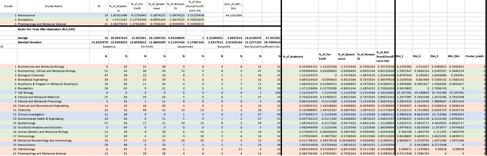

# JHU_Doc_Degree_Career_Outcome_Analysis
This project focuses on similarity of the career outcome for different doctoral program in Johns Hopkins University (JHU) in 10 years. It can serve as a guideline for multiple things, such as resources distribution for career advicing, networking events, cross program alumni reunion, etc. I grouped 21 docoral programs in the area of life science in JHU into three clusters, for which you can see below:

s
