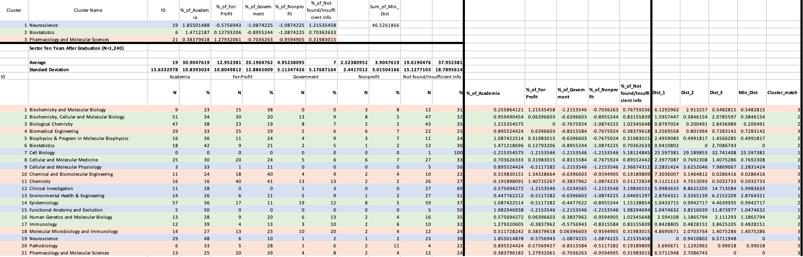
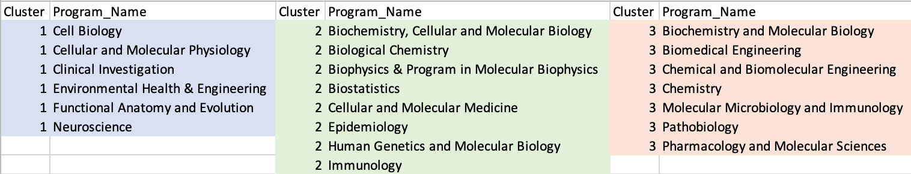
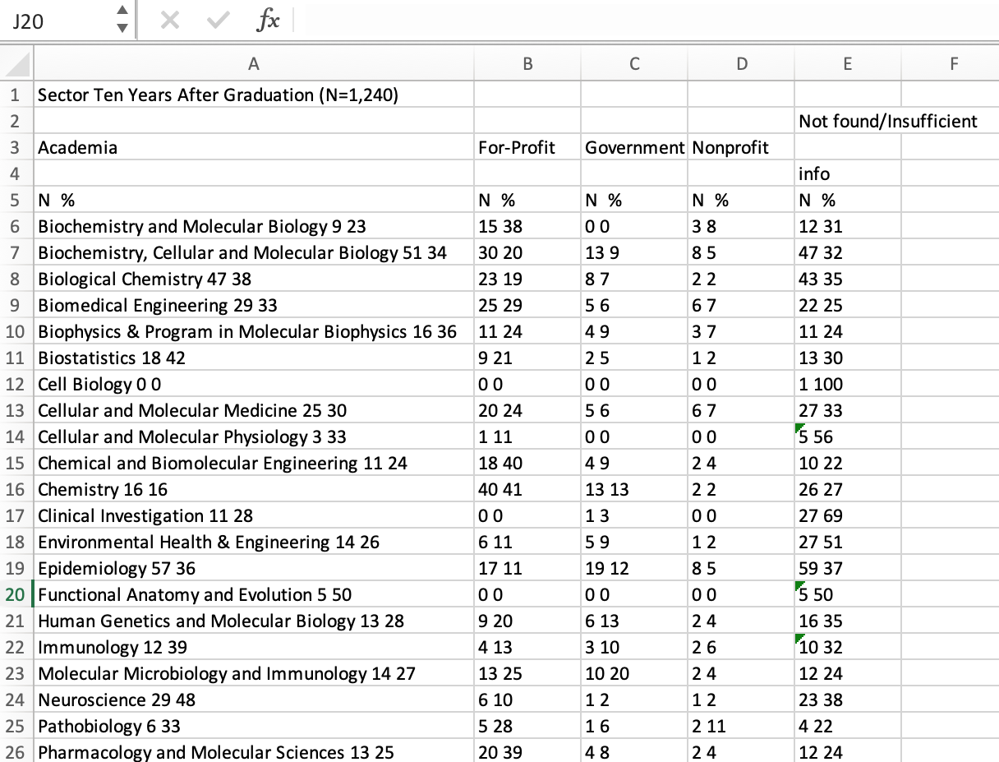
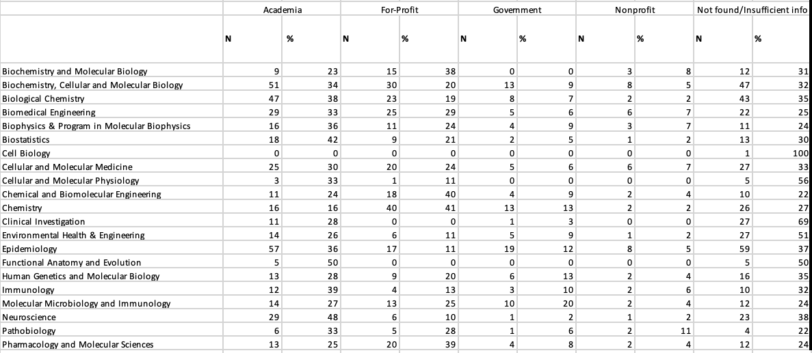
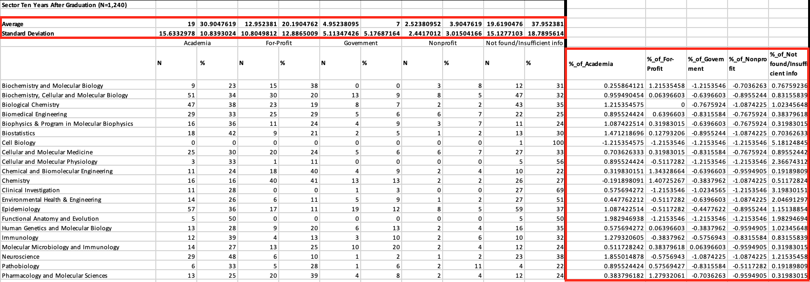
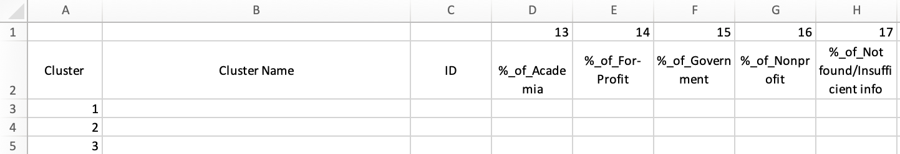
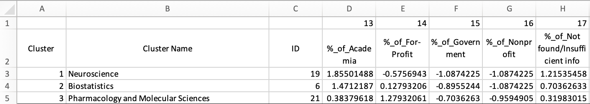
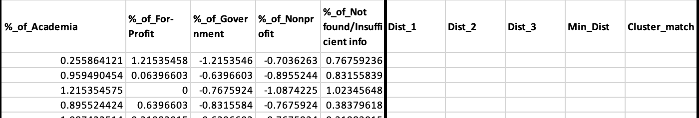

# JHU_Doc_Degree_Career_Outcome_Clustering_Analysis
## Introduction
This project focuses on similarity of the career outcome for different doctoral program in Johns Hopkins University (JHU) in 10 years. It can serve as a guideline for multiple things, such as resources distribution for career advicing, networking events, cross program alumni reunion, etc. I grouped 21 docoral programs in the area of life science in JHU into three clusters, for which you can see below:

## Outline of the Analysis
* Industry question: how can JHU maximize its career advicing resourses for doctoral program in life science? How can they manage the alumni networking events wisely so that everyone can get the most out of those events?
* Data question: In a ten years point, what are the programs that have similar distributions for career outcomes?
* Data answer: 

* Industry answer: The distribution for three clusters are pretty even. By just looking at the name of the doctoal programs, I am not suprise to see that Biomedical Engineering, Chemical and Biomolecular Engineering along with other more "practical" program are within the same cluster. Combining with the first picture above, we can see that a large percent of alumni get in for-profit businesses in ten years after finishing the program.
## Source of data
All the data in this research are extracted from [Next Generation Life Science (NGLS)](http://nglscoalition.org/coalition-data/#close). It is a website that can help directing users to the doctoral program outcome page for over 50 schools. From NGLS, the website of [Coalition for Next Generation Life Science of JHU](https://provost.jhu.edu/education/graduate-and-professional-education/cngls/) is found. A [pdf version of Doctoral Career Outcomes](Career-Outcome-ADA-Tables-Final.pdf) is extracted from CNGLS JHU.

[Tabula](https://tabula.technology/) is used to convert the pdf file into [csv](JHU_Doctoral_Career_Outcome_Cluster_Analysis.csv) version. At last, a [excel version](JHU_Doctoral_Career_Outcome_Cluster_Analysis.xlsx) of it is being used for analysis.
## Step by Step Excel Manipulation
### Data Cleaning
First we need to move tha data we want to analyze into a new worksheet and clean it up, format it so we can use it for further processes. When we first paste the data we needed in a new worksheet, it would look like this:

As we can see, some titles are messed together and some data are combined together in one column. I will use two methods to separate them. For the first columni where program name and data are messed together, I used a function in excel called `Flash Fill`, the short-cut for it is `Ctrl + E` for both Mac and Windows users. For the rest of the column where the data are messed together, I used `Text to Columns`.
#### Flash Fill
1. Insert three columns after the first column
2. Manually type in the program name, first data and the second data in the three new column
3. Select each column and press `Ctrl + E`, the data will separate autoly.
4. Delete the original first column
#### Text to Columns
5. Insert a column after the messed data column
6. Click on `Data -> Text to Columns`
7. Click on "Next", and select separate by **Space**
8. Click on Finish. The data will separate autoly.

Below is the preview of the data after cleaning:

### Calculate the Standardize Value
For analysis, I used the percentage instead of the number of the outcome. We will need the standardize value to calculate clusters. In order to calculate the standardize value using the `=STANDARDIZE()` in excel, we need the average and standard deviation for each column. 
1. insert two rows above the data and its label, name them as **Average** and **Standard Deviation**
2. Calculate the average and standard deviation for each column with `=AVERAGE()` and `=STDEV()`
3. Create columns after all the data, name them as "% of _Industry_"
4. Fill the cells with the standardize function `=STANDARDIZE(x,mean,standard_dev)`

Below is the preview of the layout of the standardize value :

### Preperation for Cluster
Before using Excel Solver to calculate the optimized cluster combinations, we need to format the worksheet. The idea here is to list out three rows of data that act as the center of the clusters. Then, the total distant for each program to each cluster center. After that, the min_distant is selected and the sum of distant is calculated.
#### The Cluster Center
1. Create five column in the top of the worksheet, and name them like this:

The numbers in the very top is the column number of the label below, and it's add for the convienient of using Vlookup. ID is related to the number of the order of programs.
2. Randomly assign the ID in the ID column. Use `=Vlookup()` to fill all the other cells in the area.

#### The Distant Part
1. Insert five columns after the data, and name them like this:

2. Calculate the dist_1/2/3 using the function `=SUMXMY2()`
3. Choosing the Min_Dist from the three dist using the function `=MIN()`
